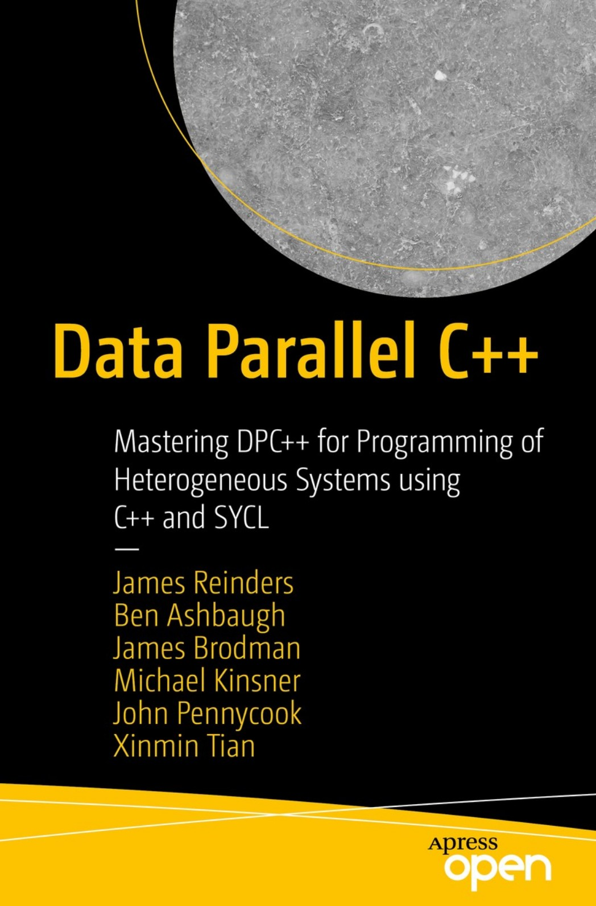

  
<h1 align="center">
  
Data Parallel C++

  
</h1>
  

<b>James Reinders · Ben Ashbaugh · James Brodman · Michael Kinsner · John Pennycook · Xinmin Tian 저</b> 
Apress · 2020년 11월 2일 출시 
[[github](https://github.com/Apress/data-parallel-CPP)]</b> 

## :bulb: 목표

- **Data Parallel C++를 익힌다.**

  > Data Parallel C++를 바탕으로 heterogenous programming를 익힌다.

 

## :mag: 목차

### Chapter 1: Introduction

### Chapter 2: Where Code Executes

### Chapter 3: Data Management

### Chapter 4: Expressing Parallelism

### Chapter 5: Error Handling

### Chapter 6: Unified Shared Memory

### Chapter 7: Buffers

### Chapter 8: Scheduling Kernels and Data Movement

### Chapter 9: Communication and Synchronization 

### Chapter 10: Defining Kernels

### Chapter 11: Vectors

### Chapter 12: Device Information

### Chapter 13: Practical Tips

### Chapter 14: Common Parallel Patterns

### Chapter 15: Programming for GPUs

### Chapter 16: Programming for CPUs

### Chapter 17: Programming for FPGAs

### Chapter 18: Libraries

### Chapter 19: Memory Model and Atomics

### Epilogue: Future Direction of DPC++